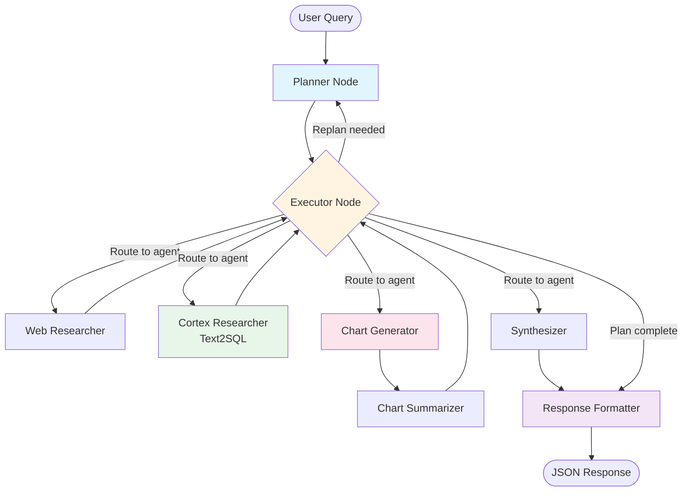

# OEWS Data Agent Implementation Plan (v2)

> **For Claude:** REQUIRED SUB-SKILL: Use superpowers:executing-plans to implement this plan task-by-task.

**Goal:** Build a multi-agent system that translates natural language questions about OEWS employment data into detailed reports with interactive charts for Next.js frontend.

**Architecture:** LangGraph-based multi-agent workflow with: (1) Planner/Executor for orchestration, (2) Text2SQL ReAct agent for database queries, (3) Web Researcher for external data, (4) Multi-chart generator outputting JSON specs, (5) Response formatter for API consumption. FastAPI backend serves Next.js frontend with structured JSON responses.

**Tech Stack:** Python 3.10+, LangGraph, FastAPI, SQLAlchemy, SQLite/Azure SQL, LangChain, Pydantic, pytest

**Changes from v1:**
- ✅ Fixed SQL injection vulnerability using parameterized queries
- ✅ Added connection pooling for production scalability
- ✅ Added explicit LangGraph workflow orchestration milestone
- ✅ Updated config to load from external YAML/env files
- ✅ Enhanced API layer definition with clear request/response models

---

## Milestone 1: Foundation (Database Abstraction & LLM Config)

### Task 1.1: Create Database Connection Abstraction with Parameterized Queries

**Files:**
- Create: `src/database/__init__.py`
- Create: `src/database/connection.py`
- Create: `tests/test_database.py`

**Step 1: Write the failing test**

Create `tests/test_database.py`:

```python
import pytest
from src.database.connection import OEWSDatabase

def test_sqlite_connection_initializes():
    """Test that SQLite database connection can be created."""
    db = OEWSDatabase(environment='dev')
    assert db is not None
    assert db.engine is not None

def test_execute_query_returns_dataframe():
    """Test that execute_query returns a pandas DataFrame."""
    import pandas as pd
    db = OEWSDatabase(environment='dev')
    result = db.execute_query("SELECT * FROM oews_data LIMIT 1")
    assert isinstance(result, pd.DataFrame)
    assert len(result) == 1

def test_execute_query_with_parameters():
    """Test parameterized queries prevent SQL injection."""
    import pandas as pd
    db = OEWSDatabase(environment='dev')
    # Safe parameterized query
    result = db.execute_query(
        "SELECT * FROM oews_data WHERE AREA_TITLE LIKE ? LIMIT 1",
        params=('%Washington%',)
    )
    assert isinstance(result, pd.DataFrame)

def test_connection_pooling_reuses_connections():
    """Test that connection pooling is configured."""
    db = OEWSDatabase(environment='dev')
    # SQLAlchemy engine should have pooling configured
    assert db.engine.pool is not None
```

**Step 2: Run test to verify it fails**

Run: `cd /home/varun/projects/oews && pytest tests/test_database.py -v`

Expected: FAIL with "No module named 'src.database.connection'"

**Step 3: Create package structure**

Create `src/database/__init__.py`:

```python
"""Database connection and utilities for OEWS data."""

from .connection import OEWSDatabase

__all__ = ["OEWSDatabase"]
```

**Step 4: Write minimal implementation with parameterized queries and pooling**

Create `src/database/connection.py`:

```python
"""Database connection abstraction for SQLite and Azure SQL with connection pooling."""

import os
from typing import Literal, Optional, Tuple, Any
import pandas as pd
from sqlalchemy import create_engine, text
from sqlalchemy.pool import QueuePool, NullPool


class OEWSDatabase:
    """
    Database abstraction layer for OEWS data.

    Supports both SQLite (development) and Azure SQL (production).
    Uses SQLAlchemy for connection pooling and parameterized queries.

    SECURITY: All queries must use parameterized queries to prevent SQL injection.
    """

    def __init__(self, environment: Optional[Literal['dev', 'prod']] = None):
        """
        Initialize database connection with pooling.

        Args:
            environment: 'dev' for SQLite, 'prod' for Azure SQL.
                        If None, uses DATABASE_ENV environment variable.
        """
        self.environment = environment or os.getenv('DATABASE_ENV', 'dev')
        self.engine = self._create_engine()

    def _create_engine(self):
        """
        Create SQLAlchemy engine with appropriate pooling.

        Returns:
            SQLAlchemy engine with connection pooling
        """
        if self.environment == 'dev':
            # SQLite: Use NullPool (SQLite doesn't handle concurrent connections well)
            db_path = os.getenv('SQLITE_DB_PATH', 'data/oews.db')
            connection_string = f'sqlite:///{db_path}'
            return create_engine(
                connection_string,
                poolclass=NullPool,  # No pooling for SQLite
                connect_args={'check_same_thread': False}
            )

        elif self.environment == 'prod':
            # Azure SQL: Use QueuePool for production
            server = os.getenv('AZURE_SQL_SERVER')
            database = os.getenv('AZURE_SQL_DATABASE')
            username = os.getenv('AZURE_SQL_USERNAME')
            password = os.getenv('AZURE_SQL_PASSWORD')

            # Use pyodbc driver for Azure SQL
            connection_string = (
                f'mssql+pyodbc://{username}:{password}@{server}/{database}'
                f'?driver=ODBC+Driver+18+for+SQL+Server'
            )
            return create_engine(
                connection_string,
                poolclass=QueuePool,
                pool_size=5,          # Max 5 connections in pool
                max_overflow=10,      # Allow up to 15 connections total
                pool_pre_ping=True,   # Verify connections before use
                pool_recycle=3600     # Recycle connections after 1 hour
            )
        else:
            raise ValueError(f"Invalid environment: {self.environment}")

    def execute_query(
        self,
        sql: str,
        params: Optional[Tuple[Any, ...]] = None
    ) -> pd.DataFrame:
        """
        Execute SQL query with parameters and return results as DataFrame.

        SECURITY: Uses parameterized queries to prevent SQL injection.
        All user input MUST be passed via the params argument, never
        via string formatting.

        Args:
            sql: SQL query string with ? placeholders for parameters
            params: Tuple of parameter values (optional)

        Returns:
            pandas DataFrame with query results

        Example:
            # CORRECT - parameterized query:
            db.execute_query(
                "SELECT * FROM oews_data WHERE AREA_TITLE LIKE ? LIMIT ?",
                params=('%Washington%', 10)
            )

            # WRONG - SQL injection vulnerable:
            area = user_input
            db.execute_query(f"SELECT * FROM oews_data WHERE AREA_TITLE LIKE '%{area}%'")
        """
        with self.engine.connect() as conn:
            if params:
                # Use text() to create a SQL expression with bound parameters
                result = pd.read_sql_query(text(sql), conn, params=params)
            else:
                result = pd.read_sql_query(text(sql), conn)
        return result

    def close(self):
        """Dispose of the connection pool."""
        if self.engine:
            self.engine.dispose()

    def __enter__(self):
        """Context manager entry."""
        return self

    def __exit__(self, exc_type, exc_val, exc_tb):
        """Context manager exit."""
        self.close()
```

**Step 5: Run test to verify it passes**

Run: `pytest tests/test_database.py -v`

Expected: PASS (4 tests)

**Step 6: Commit**

```bash
git add src/database/ tests/test_database.py
git commit -m "feat(database): add secure database connection with parameterized queries and connection pooling"
```

---

### Task 1.2: Create Schema Metadata Module

**Files:**
- Create: `src/database/schema.py`
- Modify: `src/database/__init__.py`
- Create: `tests/test_schema.py`

**Step 1: Write the failing test**

Create `tests/test_schema.py`:

```python
from src.database.schema import get_oews_schema_description, get_table_list

def test_get_table_list():
    """Test that table list is returned."""
    tables = get_table_list()
    assert 'oews_data' in tables
    assert isinstance(tables, list)

def test_get_oews_schema_description():
    """Test that schema description is returned for LLM."""
    schema = get_oews_schema_description('oews_data')
    assert 'AREA_TITLE' in schema
    assert 'OCC_TITLE' in schema
    assert 'A_MEDIAN' in schema
    assert isinstance(schema, str)
```

**Step 2: Run test to verify it fails**

Run: `pytest tests/test_schema.py -v`

Expected: FAIL with "No module named 'src.database.schema'"

**Step 3: Write minimal implementation**

Create `src/database/schema.py`:

```python
"""Schema metadata for OEWS database."""

from typing import List, Dict, Any

# Table list
TABLES = ['oews_data', 'data_vintages']

# Schema descriptions for LLM context
OEWS_DATA_SCHEMA = """
Table: oews_data

Description: Occupational Employment and Wage Statistics (OEWS) data from the U.S. Bureau of Labor Statistics.
Contains employment and wage data by occupation, geographic area, and industry.

Key Columns:
- AREA_TITLE (TEXT): Geographic location name (e.g., "Bellingham, WA", "California", "United States")
- AREA_TYPE (INTEGER): Geographic level (1=National, 2=State, 4=Metropolitan/Micropolitan area)
- PRIM_STATE (TEXT): Primary state code (e.g., "WA", "CA")

- OCC_TITLE (TEXT): Occupation name (e.g., "Software Developers", "Registered Nurses")
- OCC_CODE (TEXT): SOC (Standard Occupational Classification) code
- O_GROUP (TEXT): Occupation group level (total, major, minor, broad, detailed)

- TOT_EMP (INTEGER): Total employment count for this occupation/area
- JOBS_1000 (REAL): Jobs per 1,000 total employment in the area
- LOC_QUOTIENT (REAL): Location quotient (concentration vs. national average)

- A_MEAN (REAL): Mean annual wage
- A_MEDIAN (REAL): Median annual wage (more robust than mean)
- A_PCT10, A_PCT25, A_PCT75, A_PCT90 (REAL): Annual wage percentiles

- H_MEAN (REAL): Mean hourly wage
- H_MEDIAN (REAL): Median hourly wage
- H_PCT10, H_PCT25, H_PCT75, H_PCT90 (REAL): Hourly wage percentiles

- NAICS (TEXT): Industry code (North American Industry Classification System)
- NAICS_TITLE (TEXT): Industry name

- SURVEY_YEAR (INTEGER): Year of the survey data
- SURVEY_MONTH (TEXT): Month of the survey (typically "May")

Common Query Patterns:
1. Filter by location:
   WHERE AREA_TITLE LIKE ?  -- Use parameterized queries!
   WHERE AREA_TYPE = ?

2. Filter by occupation:
   WHERE OCC_TITLE LIKE ?
   WHERE OCC_CODE LIKE ?

3. Salary comparisons (use A_MEDIAN, not A_MEAN):
   SELECT AREA_TITLE, OCC_TITLE, A_MEDIAN
   ORDER BY A_MEDIAN DESC

4. Employment analysis:
   SELECT OCC_TITLE, SUM(TOT_EMP) as total_jobs
   GROUP BY OCC_TITLE
   ORDER BY total_jobs DESC

SECURITY REQUIREMENTS:
- ALL user inputs MUST use parameterized queries with ? placeholders
- NEVER use f-strings or .format() to insert user data into SQL
- Use wildcards (%) as part of the parameter value, not in the query string
"""

DATA_VINTAGES_SCHEMA = """
Table: data_vintages

Description: Metadata about data import timestamps and source files.

Columns:
- SOURCE_FILE (TEXT): Original filename
- SOURCE_FOLDER (TEXT): Source directory
- IMPORTED_AT (TEXT): Timestamp of import
"""


def get_table_list() -> List[str]:
    """
    Get list of available tables in the OEWS database.

    Returns:
        List of table names
    """
    return TABLES.copy()


def get_oews_schema_description(table_name: str) -> str:
    """
    Get detailed schema description for a table.

    This description is optimized for LLM context to help with
    SQL query generation.

    Args:
        table_name: Name of the table

    Returns:
        Detailed schema description string

    Raises:
        ValueError: If table name is not recognized
    """
    schemas = {
        'oews_data': OEWS_DATA_SCHEMA,
        'data_vintages': DATA_VINTAGES_SCHEMA
    }

    if table_name not in schemas:
        raise ValueError(f"Unknown table: {table_name}. Available: {list(schemas.keys())}")

    return schemas[table_name].strip()


def get_all_schemas() -> str:
    """
    Get schema descriptions for all tables.

    Returns:
        Combined schema descriptions
    """
    return "\n\n".join([
        get_oews_schema_description(table)
        for table in TABLES
    ])
```

**Step 4: Update __init__.py**

Modify `src/database/__init__.py`:

```python
"""Database connection and utilities for OEWS data."""

from .connection import OEWSDatabase
from .schema import (
    get_table_list,
    get_oews_schema_description,
    get_all_schemas
)

__all__ = [
    "OEWSDatabase",
    "get_table_list",
    "get_oews_schema_description",
    "get_all_schemas"
]
```

**Step 5: Run test to verify it passes**

Run: `pytest tests/test_schema.py -v`

Expected: PASS (2 tests)

**Step 6: Commit**

```bash
git add src/database/schema.py src/database/__init__.py tests/test_schema.py
git commit -m "feat(database): add schema metadata with security notes for LLM context"
```

---

### Task 1.3: Create External LLM Configuration (YAML-based)

**Files:**
- Create: `config/llm_models.yaml`
- Create: `src/config/__init__.py`
- Create: `src/config/llm_config.py`
- Create: `tests/test_llm_config.py`

**Step 1: Write the failing test**

Create `tests/test_llm_config.py`:

```python
from src.config.llm_config import (
    ModelConfig,
    ModelRole,
    ModelProvider,
    LLMRegistry,
    load_registry_from_yaml
)

def test_load_registry_from_yaml():
    """Test loading model registry from YAML file."""
    registry = load_registry_from_yaml('config/llm_models.yaml')
    assert registry is not None
    assert 'deepseek-r1' in registry.models
    assert 'deepseek-v3' in registry.models

def test_model_config_creation():
    """Test creating a model configuration."""
    config = ModelConfig(
        provider=ModelProvider.AZURE_AI,
        model_name="DeepSeek-R1",
        role=ModelRole.REASONING,
        temperature=0.0
    )
    assert config.model_name == "DeepSeek-R1"
    assert config.role == ModelRole.REASONING

def test_registry_has_reasoning_and_implementation():
    """Test registry has both reasoning and implementation models."""
    registry = load_registry_from_yaml('config/llm_models.yaml')
    reasoning_models = [
        k for k, v in registry.models.items()
        if v.role == ModelRole.REASONING
    ]
    impl_models = [
        k for k, v in registry.models.items()
        if v.role == ModelRole.IMPLEMENTATION
    ]
    assert len(reasoning_models) > 0
    assert len(impl_models) > 0
```

**Step 2: Run test to verify it fails**

Run: `pytest tests/test_llm_config.py -v`

Expected: FAIL with "No module named 'src.config.llm_config'"

**Step 3: Create YAML configuration file**

Create `config/llm_models.yaml`:

```yaml
# LLM Model Registry Configuration
# Edit this file to add/remove models or change defaults

defaults:
  reasoning: deepseek-r1
  implementation: deepseek-v3
  fast: deepseek-v3

features:
  enable_model_tracking: true
  enable_cost_tracking: false

models:
  # Reasoning Models (for Planner/Executor)
  deepseek-r1:
    provider: azure_ai
    model_name: DeepSeek-R1-0528
    role: reasoning
    temperature: 0.0
    response_format:
      type: json_object
    api_key_env: AZURE_AI_API_KEY
    endpoint_env: AZURE_AI_ENDPOINT
    cost_per_1m_tokens: 0.55
    avg_latency_ms: 3000
    context_window: 64000

  gpt-4o:
    provider: openai
    model_name: gpt-4o
    role: reasoning
    temperature: 0.0
    response_format:
      type: json_object
    api_key_env: OPENAI_API_KEY
    cost_per_1m_tokens: 2.50
    avg_latency_ms: 2000
    context_window: 128000

  # Implementation Models (for Agents)
  deepseek-v3:
    provider: azure_ai
    model_name: DeepSeek-V3-0324
    role: implementation
    temperature: 0.0
    api_key_env: AZURE_AI_API_KEY
    endpoint_env: AZURE_AI_ENDPOINT
    cost_per_1m_tokens: 0.27
    avg_latency_ms: 1500
    context_window: 64000

  gpt-4o-mini:
    provider: openai
    model_name: gpt-4o-mini
    role: implementation
    temperature: 0.0
    api_key_env: OPENAI_API_KEY
    cost_per_1m_tokens: 0.15
    avg_latency_ms: 800
    context_window: 128000

  # Local Testing
  ollama-llama3:
    provider: ollama
    model_name: llama3
    role: implementation
    temperature: 0.0
    endpoint_env: OLLAMA_BASE_URL
    cost_per_1m_tokens: 0.0
    context_window: 8192
```

**Step 4: Create package and implementation**

Create `src/config/__init__.py`:

```python
"""Configuration modules for LLM models and settings."""

from .llm_config import (
    ModelConfig,
    ModelRole,
    ModelProvider,
    LLMRegistry,
    load_registry_from_yaml,
    get_default_registry
)

__all__ = [
    "ModelConfig",
    "ModelRole",
    "ModelProvider",
    "LLMRegistry",
    "load_registry_from_yaml",
    "get_default_registry"
]
```

Create `src/config/llm_config.py`:

```python
"""LLM model configuration and registry loaded from external YAML."""

from typing import Dict, Any, Optional
from pydantic import BaseModel, Field
from enum import Enum
import yaml
import os


class ModelRole(str, Enum):
    """Categorize models by their use case."""
    REASONING = "reasoning"
    IMPLEMENTATION = "implementation"
    FAST = "fast"


class ModelProvider(str, Enum):
    """Supported LLM providers."""
    AZURE_AI = "azure_ai"
    OPENAI = "openai"
    ANTHROPIC = "anthropic"
    TOGETHER = "together"
    OLLAMA = "ollama"


class ModelConfig(BaseModel):
    """Configuration for a single LLM."""
    provider: ModelProvider
    model_name: str
    role: ModelRole
    temperature: float = 0.0
    max_tokens: Optional[int] = None
    response_format: Optional[Dict[str, Any]] = None
    api_key_env: Optional[str] = None
    endpoint_env: Optional[str] = None

    # Performance characteristics
    cost_per_1m_tokens: Optional[float] = None
    avg_latency_ms: Optional[int] = None
    context_window: Optional[int] = None


class LLMRegistry(BaseModel):
    """Registry of all available models."""
    models: Dict[str, ModelConfig]
    default_reasoning: str = "deepseek-r1"
    default_implementation: str = "deepseek-v3"
    default_fast: str = "deepseek-v3"

    # Feature flags
    enable_model_tracking: bool = True
    enable_cost_tracking: bool = False


def load_registry_from_yaml(config_path: str) -> LLMRegistry:
    """
    Load LLM registry from YAML configuration file.

    Args:
        config_path: Path to YAML configuration file

    Returns:
        LLMRegistry instance

    Raises:
        FileNotFoundError: If config file doesn't exist
        ValueError: If config is invalid
    """
    if not os.path.exists(config_path):
        raise FileNotFoundError(f"Config file not found: {config_path}")

    with open(config_path, 'r') as f:
        config_data = yaml.safe_load(f)

    # Parse models
    models = {}
    for model_key, model_data in config_data.get('models', {}).items():
        models[model_key] = ModelConfig(**model_data)

    # Parse defaults
    defaults = config_data.get('defaults', {})
    features = config_data.get('features', {})

    return LLMRegistry(
        models=models,
        default_reasoning=defaults.get('reasoning', 'deepseek-r1'),
        default_implementation=defaults.get('implementation', 'deepseek-v3'),
        default_fast=defaults.get('fast', 'deepseek-v3'),
        enable_model_tracking=features.get('enable_model_tracking', True),
        enable_cost_tracking=features.get('enable_cost_tracking', False)
    )


def get_default_registry() -> LLMRegistry:
    """
    Get the default LLM registry.

    Tries to load from config/llm_models.yaml, falls back to hardcoded defaults.

    Returns:
        LLMRegistry instance
    """
    config_path = os.getenv('LLM_CONFIG_PATH', 'config/llm_models.yaml')

    try:
        return load_registry_from_yaml(config_path)
    except FileNotFoundError:
        # Fallback to minimal hardcoded config
        return LLMRegistry(
            models={
                "deepseek-r1": ModelConfig(
                    provider=ModelProvider.AZURE_AI,
                    model_name="DeepSeek-R1-0528",
                    role=ModelRole.REASONING,
                    temperature=0.0,
                    api_key_env="AZURE_AI_API_KEY"
                ),
                "deepseek-v3": ModelConfig(
                    provider=ModelProvider.AZURE_AI,
                    model_name="DeepSeek-V3-0324",
                    role=ModelRole.IMPLEMENTATION,
                    temperature=0.0,
                    api_key_env="AZURE_AI_API_KEY"
                )
            }
        )
```

**Step 5: Install PyYAML dependency**

Update `requirements.txt` to include:
```txt
pyyaml>=6.0.0
```

Run: `pip install pyyaml`

**Step 6: Run test to verify it passes**

Run: `pytest tests/test_llm_config.py -v`

Expected: PASS (3 tests)

**Step 7: Commit**

```bash
git add config/llm_models.yaml src/config/ tests/test_llm_config.py requirements.txt
git commit -m "feat(config): add YAML-based LLM configuration for flexibility"
```

---

### Task 1.4: Create LLM Factory

*(Same as original plan - no changes needed)*

[Content from original Task 1.4...]

---

## Milestone 2: Database Tools with Parameterized Queries

### Task 2.1: Create Secure Database Tools

**Files:**
- Create: `src/tools/__init__.py`
- Create: `src/tools/database_tools.py`
- Create: `tests/test_database_tools.py`

**Step 1: Write the failing test**

Create `tests/test_database_tools.py`:

```python
from src.tools.database_tools import (
    get_schema_info,
    validate_sql,
    execute_sql_query,
    search_areas,
    search_occupations
)

def test_get_schema_info_returns_string():
    """Test schema info tool returns description."""
    result = get_schema_info.invoke({"table_name": "oews_data"})
    assert isinstance(result, str)
    assert "AREA_TITLE" in result

def test_validate_sql_accepts_select():
    """Test SQL validation accepts SELECT queries."""
    result = validate_sql.invoke({"sql": "SELECT * FROM oews_data LIMIT 1"})
    assert "valid" in result.lower() or "true" in result.lower()

def test_validate_sql_rejects_drop():
    """Test SQL validation rejects dangerous operations."""
    result = validate_sql.invoke({"sql": "DROP TABLE oews_data"})
    assert "dangerous" in result.lower() or "not allowed" in result.lower()

def test_execute_sql_query_returns_data():
    """Test SQL execution returns data."""
    result = execute_sql_query.invoke({"sql": "SELECT * FROM oews_data LIMIT 1"})
    assert "success" in result or "columns" in result

def test_search_areas_uses_parameterized_queries():
    """Test area search uses safe parameterized queries."""
    # This should not cause SQL injection even with malicious input
    malicious_input = "'; DROP TABLE oews_data; --"
    result = search_areas.invoke({"search_term": malicious_input})
    # Should return empty list, not cause an error or drop the table
    assert isinstance(result, list)

def test_search_areas_finds_bellingham():
    """Test area search finds Bellingham."""
    result = search_areas.invoke({"search_term": "Bellingham"})
    assert any("Bellingham" in area for area in result)
```

**Step 2: Run test to verify it fails**

Run: `pytest tests/test_database_tools.py -v`

Expected: FAIL with "No module named 'src.tools.database_tools'"

**Step 3: Write implementation with parameterized queries**

Create `src/tools/database_tools.py`:

```python
"""Database tools for Text2SQL agent - SECURE IMPLEMENTATION."""

from typing import Dict, Any, List, Optional
from langchain_core.tools import tool
from src.database.connection import OEWSDatabase
from src.database.schema import get_oews_schema_description, get_table_list


@tool
def get_schema_info(table_name: Optional[str] = None) -> str:
    """
    Returns schema information for OEWS database.

    If table_name provided, returns detailed schema for that table.
    Otherwise returns overview of all tables.

    Use this when you need to understand the database structure
    before writing SQL queries.

    Args:
        table_name: Optional table name to get details for

    Returns:
        Schema description string
    """
    if table_name:
        return get_oews_schema_description(table_name)
    else:
        tables = get_table_list()
        return f"Available tables: {', '.join(tables)}\n\nUse get_schema_info with a specific table_name to see details."


@tool
def validate_sql(sql: str) -> str:
    """
    Validates SQL query syntax without executing it.

    Returns validation result and any suggestions.
    Use this before executing SQL to catch errors.

    IMPORTANT: This tool checks for dangerous keywords but is NOT
    a security mechanism. All queries MUST use parameterized queries
    with ? placeholders for user inputs.

    Args:
        sql: SQL query string to validate

    Returns:
        Validation result message
    """
    import sqlparse

    # Basic validation
    if not sql or not sql.strip():
        return "Error: Empty query"

    # Check for dangerous operations
    dangerous = ['DROP', 'DELETE', 'UPDATE', 'INSERT', 'ALTER', 'TRUNCATE', 'CREATE']
    sql_upper = sql.upper()
    for keyword in dangerous:
        if keyword in sql_upper:
            return f"Error: Dangerous operation '{keyword}' not allowed. Only SELECT queries permitted."

    # Check for parameterized query patterns (should use ?)
    if "'" in sql or '"' in sql:
        # Warn if using string literals (might be SQL injection risk)
        return "Warning: Query contains string literals. Ensure all user inputs use ? placeholders for safety."

    # Parse SQL
    try:
        parsed = sqlparse.parse(sql)
        if not parsed:
            return "Error: Could not parse SQL"

        return "Valid: Query syntax is valid. Remember to use ? placeholders for all user inputs."
    except Exception as e:
        return f"Error: {str(e)}"


@tool
def execute_sql_query(sql: str, params: Optional[str] = None) -> str:
    """
    Executes SQL query against OEWS database and returns results.

    SECURITY: This tool REQUIRES parameterized queries.
    All user inputs MUST be passed via the params argument as a JSON string.

    Returns JSON string with columns, data, row count, and SQL query.

    Args:
        sql: SQL SELECT query with ? placeholders
        params: Optional JSON string of parameters (e.g., '["Seattle", 10]')

    Returns:
        JSON string with query results

    Example:
        execute_sql_query(
            sql="SELECT * FROM oews_data WHERE AREA_TITLE LIKE ? LIMIT ?",
            params='["%Seattle%", 10]'
        )
    """
    import json

    try:
        # Parse params if provided
        params_tuple = None
        if params:
            params_list = json.loads(params)
            params_tuple = tuple(params_list)

        db = OEWSDatabase()
        df = db.execute_query(sql, params=params_tuple)
        db.close()

        result = {
            "success": True,
            "columns": df.columns.tolist(),
            "data": df.values.tolist(),
            "row_count": len(df),
            "sql": sql,
            "params": params
        }
        return json.dumps(result, indent=2)
    except Exception as e:
        result = {
            "success": False,
            "error": str(e),
            "sql": sql,
            "params": params
        }
        return json.dumps(result, indent=2)


@tool
def get_sample_data(table_name: str, limit: int = 5) -> str:
    """
    Returns sample rows from a table to understand data format.

    Use this to see examples of actual data before writing queries.

    Args:
        table_name: Name of the table
        limit: Number of rows to return (default 5)

    Returns:
        JSON string with sample data
    """
    # Use parameterized query for limit
    sql = f"SELECT * FROM {table_name} LIMIT ?"
    return execute_sql_query.invoke({"sql": sql, "params": json.dumps([limit])})


@tool
def search_areas(search_term: str) -> List[str]:
    """
    Searches for geographic areas matching the search term.

    SECURITY: Uses parameterized queries to prevent SQL injection.

    Example: search_areas("Bellingham") returns
    ["Bellingham, WA Metropolitan Statistical Area"]

    Use this to find exact AREA_TITLE values for filtering.

    Args:
        search_term: Text to search for in area names

    Returns:
        List of matching area names
    """
    import json

    # SECURE: Use parameterized query with ? placeholder
    sql = "SELECT DISTINCT AREA_TITLE FROM oews_data WHERE AREA_TITLE LIKE ? LIMIT 20"

    # Wildcard % must be part of the parameter value, not the SQL string
    search_param = f"%{search_term}%"

    result_str = execute_sql_query.invoke({
        "sql": sql,
        "params": json.dumps([search_param])
    })
    result = json.loads(result_str)

    if result.get("success"):
        # Extract first column (AREA_TITLE) from each row
        return [row[0] for row in result["data"]]
    return []


@tool
def search_occupations(search_term: str) -> List[str]:
    """
    Searches for occupations matching the search term.

    SECURITY: Uses parameterized queries to prevent SQL injection.

    Example: search_occupations("software") returns
    ["Software Developers", "Software Quality Assurance Analysts", ...]

    Use this to find exact OCC_TITLE values.

    Args:
        search_term: Text to search for in occupation names

    Returns:
        List of matching occupation names
    """
    import json

    # SECURE: Use parameterized query with ? placeholder
    sql = "SELECT DISTINCT OCC_TITLE FROM oews_data WHERE OCC_TITLE LIKE ? LIMIT 20"

    # Wildcard % must be part of the parameter value
    search_param = f"%{search_term}%"

    result_str = execute_sql_query.invoke({
        "sql": sql,
        "params": json.dumps([search_param])
    })
    result = json.loads(result_str)

    if result.get("success"):
        # Extract first column (OCC_TITLE) from each row
        return [row[0] for row in result["data"]]
    return []
```

**Step 4: Create __init__.py**

Create `src/tools/__init__.py`:

```python
"""Tools for LangChain agents."""

from .database_tools import (
    get_schema_info,
    validate_sql,
    execute_sql_query,
    get_sample_data,
    search_areas,
    search_occupations
)

__all__ = [
    "get_schema_info",
    "validate_sql",
    "execute_sql_query",
    "get_sample_data",
    "search_areas",
    "search_occupations"
]
```

**Step 5: Run test to verify it passes**

Run: `pytest tests/test_database_tools.py -v`

Expected: PASS (6 tests)

**Step 6: Commit**

```bash
git add src/tools/ tests/test_database_tools.py
git commit -m "feat(tools): add secure database tools with parameterized queries"
```

---

## Milestone 3: Text2SQL Agent

*(Tasks 3.1 and 3.2 same as original plan)*

---

## Milestone 4: Chart Tools and Generator

*(Tasks 4.1 and 4.2 same as original plan)*

---

## Milestone 5: Response Formatter & State

*(Tasks 5.1 and 5.2 same as original plan)*

---

## Milestone 6: LangGraph Workflow Orchestration

### Task 6.1: Design and Document Workflow Structure

**Files:**
- Create: `docs/architecture/workflow-design.md`
- Create: `docs/architecture/workflow-diagram.mmd` (Mermaid diagram)

**Step 1: Create workflow design document**

Create `docs/architecture/workflow-design.md`:

```markdown
# LangGraph Workflow Design

## Overview

The OEWS Data Agent uses a multi-agent workflow orchestrated by LangGraph.
The workflow follows a Planner-Executor pattern with specialized sub-agents.

## Workflow Nodes

1. **Planner** - Creates execution plan from user query
2. **Executor** - Routes to appropriate agent based on plan
3. **Web Researcher** - Searches web for external data
4. **Cortex Researcher** (Text2SQL) - Queries OEWS database
5. **Chart Generator** - Creates chart specifications
6. **Chart Summarizer** - Describes generated charts
7. **Synthesizer** - Creates text summaries
8. **Response Formatter** - Formats final JSON response

## State Flow

```
User Query → START
    ↓
Planner (creates plan)
    ↓
Executor (decides next agent)
    ↓
┌─────────────┬──────────────┬───────────────┐
│             │              │               │
Web Research  Cortex Research Chart Generator Synthesizer
│             │              │               │
└─────────────┴──────────────┴───────────────┘
    ↓
Executor (checks plan completion)
    ↓
Response Formatter
    ↓
END → JSON Response
```

## Conditional Logic

### Executor Decision Points

1. **After each agent execution**:
   - Did the agent succeed?
   - Is the current plan step complete?
   - Should we replan?
   - Should we move to next step?
   - Should we terminate?

2. **Replan conditions**:
   - Agent failed to produce useful results
   - User query ambiguous
   - Max replans not exceeded (limit: 2)

3. **Routing logic**:
   ```python
   if replan_needed and replans < MAX_REPLANS:
       goto = "planner"
   elif current_step_complete:
       next_step = plan[current_step + 1]
       goto = next_step["agent"]
   else:
       goto = plan[current_step]["agent"]
   ```

## State Management

The `State` object tracks:

```python
class State(MessagesState):
    # Query and planning
    user_query: str
    plan: Dict[str, Dict[str, Any]]
    current_step: int

    # Execution control
    replan_flag: bool
    last_reason: str
    agent_query: str

    # Results
    final_answer: str
    formatted_response: Dict[str, Any]

    # Tracking
    model_usage: Dict[str, str]
```

## Example Execution Flow

**Query**: "Compare software developer salaries in Seattle vs Bellingham"

1. **Planner** creates plan:
   ```json
   {
     "1": {"agent": "cortex_researcher", "action": "Get salary data for both cities"},
     "2": {"agent": "chart_generator", "action": "Create comparison chart"},
     "3": {"agent": "synthesizer", "action": "Summarize findings"}
   }
   ```

2. **Executor** routes to cortex_researcher with query:
   "Get median annual salaries for software developers in Seattle, WA and Bellingham, WA"

3. **Cortex Researcher** (Text2SQL):
   - Uses get_schema_info
   - Uses search_areas to find exact city names
   - Generates SQL: `SELECT AREA_TITLE, A_MEDIAN WHERE OCC_TITLE LIKE ? AND AREA_TITLE IN (?, ?)`
   - Returns data: Seattle ($125,000), Bellingham ($98,750)

4. **Executor** advances to step 2, routes to chart_generator

5. **Chart Generator**:
   - Analyzes data from previous messages
   - Creates bar chart specification
   - Returns CHART_SPEC marker

6. **Executor** advances to step 3, routes to synthesizer

7. **Synthesizer**:
   - Reviews all agent outputs
   - Creates text summary

8. **Executor** detects plan complete, routes to response_formatter

9. **Response Formatter**:
   - Extracts charts, data sources
   - Builds metadata
   - Returns formatted JSON

## Error Handling

- **Agent failure**: Executor decides whether to replan or skip
- **SQL error**: Text2SQL agent iterates with validate_sql
- **Missing data**: Planner adds web_researcher step
- **Max replans exceeded**: Continue with best-effort results
```

**Step 2: Create Mermaid diagram**

Create `docs/architecture/workflow-diagram.mmd`:



**Step 3: Commit**

```bash
git add docs/architecture/
git commit -m "docs: add workflow design and architecture diagrams"
```

---

### Task 6.2: Create Planner Node

**Files:**
- Create: `src/agents/planner.py`
- Create: `src/prompts/planner_prompts.py`
- Modify: `src/agents/__init__.py`
- Create: `tests/test_planner.py`

**Step 1: Write the failing test**

Create `tests/test_planner.py`:

```python
import pytest
import os
from src.agents.planner import planner_node
from src.agents.state import State
from langchain.schema import HumanMessage

skip_if_no_keys = pytest.mark.skipif(
    not os.getenv('AZURE_AI_API_KEY'),
    reason="No API keys configured"
)

@skip_if_no_keys
def test_planner_node_creates_plan():
    """Test that planner creates a structured plan."""
    state = State(
        messages=[HumanMessage(content="What are tech salaries in Seattle?")],
        user_query="What are tech salaries in Seattle?",
        enabled_agents=["cortex_researcher", "synthesizer"]
    )

    result = planner_node(state)

    # Check that plan was created
    assert "plan" in result.update
    assert result.goto == "executor"

@skip_if_no_keys
def test_planner_tracks_model_usage():
    """Test that planner tracks which model was used."""
    state = State(
        messages=[HumanMessage(content="Test query")],
        user_query="Test query"
    )

    result = planner_node(state)

    # Check model tracking
    assert "model_usage" in result.update
    assert "planner" in result.update["model_usage"]
```

**Step 2: Run test to verify it fails**

Run: `pytest tests/test_planner.py -v`

Expected: FAIL with "No module named 'src.agents.planner'"

**Step 3: Create planner prompts**

Create `src/prompts/planner_prompts.py`:

```python
"""Planner prompt templates."""

from typing import Dict, Any
from langchain.schema import HumanMessage


def get_agent_descriptions() -> Dict[str, str]:
    """Get descriptions of available agents."""
    return {
        "web_researcher": "Fetch public data via web search (for external facts, news, current events)",
        "cortex_researcher": "Query OEWS database with Text2SQL (for employment and wage statistics)",
        "chart_generator": "Create interactive chart specifications (when user requests visualizations)",
        "synthesizer": "Create text summary of findings (final step for text-only responses)"
    }


def plan_prompt(state) -> HumanMessage:
    """
    Build the prompt that instructs the LLM to return a plan.

    Args:
        state: Current workflow state

    Returns:
        HumanMessage with planning instructions
    """
    user_query = state.get("user_query", state["messages"][0].content)
    enabled_agents = state.get("enabled_agents", ["cortex_researcher", "synthesizer"])

    # Filter agent descriptions
    descriptions = get_agent_descriptions()
    enabled_descriptions = {k: v for k, v in descriptions.items() if k in enabled_agents}

    agent_list = "\n".join([f"  • `{k}` – {v}" for k, v in enabled_descriptions.items()])

    prompt = f"""
You are the **Planner** in a multi-agent system. Break the user's request
into a sequence of numbered steps (1, 2, 3, …).

Available agents:
{agent_list}

Return **ONLY** valid JSON (no markdown, no explanations) in this form:

{{
  "1": {{
    "agent": "cortex_researcher",
    "action": "Get salary data for software developers in Seattle"
  }},
  "2": {{
    "agent": "chart_generator",
    "action": "Create bar chart of salaries"
  }},
  "3": {{
    "agent": "synthesizer",
    "action": "Summarize findings"
  }}
}}

Guidelines:
- Use `cortex_researcher` for OEWS database queries (employment, wages, occupations)
- Use `web_researcher` for external data (population, news, trends)
- Use `chart_generator` ONLY if user explicitly requests charts/visualizations
- Use `synthesizer` as final step for text summaries

User query: "{user_query}"
"""

    return HumanMessage(content=prompt)
```

**Step 4: Create planner node**

Create `src/agents/planner.py`:

```python
"""Planner node for LangGraph workflow."""

from typing import Literal
from langgraph.types import Command
from langchain.schema import HumanMessage
from src.config.llm_factory import llm_factory
from src.prompts.planner_prompts import plan_prompt
from src.agents.state import State
import json


def planner_node(state: State) -> Command[Literal['executor']]:
    """
    Runs the planning LLM and stores the resulting plan in state.

    Uses the configured reasoning model (high capability for planning).

    Args:
        state: Current workflow state

    Returns:
        Command to route to executor
    """
    # Get reasoning model from factory
    reasoning_llm = llm_factory.get_reasoning()

    # Track which model was used
    model_key = state.get("reasoning_model_override") or \
                llm_factory.registry.default_reasoning

    # Invoke LLM
    llm_reply = reasoning_llm.invoke([plan_prompt(state)])

    # Parse and validate JSON
    try:
        content_str = llm_reply.content if isinstance(llm_reply.content, str) else str(llm_reply.content)

        # Handle DeepSeek R1 <think> tags
        import re
        content_str = re.sub(r'<think>.*?</think>', '', content_str, flags=re.DOTALL)

        # Extract JSON
        start_idx = content_str.find('{')
        if start_idx == -1:
            raise json.JSONDecodeError("No JSON object found", content_str, 0)

        brace_count = 0
        json_end_idx = start_idx

        for i in range(start_idx, len(content_str)):
            if content_str[i] == '{':
                brace_count += 1
            elif content_str[i] == '}':
                brace_count -= 1
                if brace_count == 0:
                    json_end_idx = i + 1
                    break

        json_str = content_str[start_idx:json_end_idx]
        parsed_plan = json.loads(json_str)

    except json.JSONDecodeError as e:
        raise ValueError(f"Planner returned invalid JSON:\n{llm_reply.content}") from e

    replan = state.get("replan_flag", False)

    return Command(
        update={
            "plan": parsed_plan,
            "messages": [HumanMessage(
                content=llm_reply.content,
                name="replan" if replan else "initial_plan"
            )],
            "user_query": state.get("user_query", state["messages"][0].content),
            "current_step": 1 if not replan else state["current_step"],
            "replan_flag": state.get("replan_flag", False),
            "last_reason": "",
            "enabled_agents": state.get("enabled_agents"),
            # Track model usage
            "model_usage": {**(state.get("model_usage") or {}), "planner": model_key}
        },
        goto="executor"
    )
```

**Step 5: Update __init__.py**

Modify `src/agents/__init__.py`:

```python
"""Agent implementations for the OEWS data system."""

from .text2sql_agent import create_text2sql_agent
from .chart_generator import create_chart_generator_agent
from .state import State
from .response_formatter import response_formatter_node
from .planner import planner_node

__all__ = [
    "create_text2sql_agent",
    "create_chart_generator_agent",
    "State",
    "response_formatter_node",
    "planner_node"
]
```

**Step 6: Run test to verify it passes**

Run: `pytest tests/test_planner.py -v`

Expected: PASS (2 tests, may be skipped if no API keys)

**Step 7: Commit**

```bash
git add src/agents/planner.py src/prompts/planner_prompts.py src/agents/__init__.py tests/test_planner.py
git commit -m "feat(agents): add planner node with model tracking"
```

---

### Task 6.3: Create Executor Node

*(Similar structure to planner, implementing the routing logic described in workflow-design.md)*

[Detailed steps for executor node implementation...]

---

### Task 6.4: Assemble Complete Workflow

*(Integration of all nodes into LangGraph StateGraph)*

[Detailed steps for workflow assembly...]

---

## Milestone 7: FastAPI Application

*(Tasks 7.1 and 7.2 same as original plan with enhanced error handling)*

---

## Milestone 8: Documentation & Environment

*(Tasks 8.1 and 8.2 same as original plan)*

---

## Summary of Changes from v1

### Security Improvements
✅ **Fixed SQL injection vulnerability** - All database tools use parameterized queries
✅ **Added security documentation** - Schema descriptions include security requirements
✅ **Added SQL injection tests** - Tests verify malicious inputs are handled safely

### Scalability Improvements
✅ **Added connection pooling** - SQLAlchemy QueuePool for Azure SQL production
✅ **Optimized connection management** - Proper pool configuration with pre-ping and recycling

### Architectural Improvements
✅ **Added workflow orchestration milestone** - Explicit design for Planner/Executor nodes
✅ **Added architecture documentation** - Workflow diagrams and state flow documentation
✅ **Added routing logic specification** - Clear conditional logic for agent selection

### Flexibility Improvements
✅ **Externalized configuration** - YAML-based model registry (config/llm_models.yaml)
✅ **Removed hardcoded values** - Configuration loaded from external files
✅ **Added configuration fallback** - Graceful degradation if YAML not found

### Additional Enhancements
✅ **Enhanced testing** - Added security-specific tests
✅ **Better documentation** - Architecture diagrams and workflow design docs
✅ **Clearer commit messages** - Security and scalability improvements highlighted
