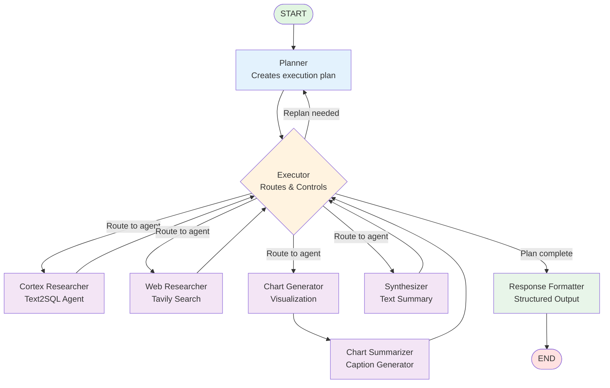

# OEWS Data Agent Workflow Visualization

## Workflow Architecture

The OEWS Data Agent uses a multi-agent LangGraph workflow with dynamic routing through an executor node.

## Mermaid Diagram



## Detailed Flow Description

### 1. Entry Point: START → Planner
- User query enters the workflow
- Planner uses DeepSeek-R1 (reasoning model) to create a multi-step plan
- Plan specifies which agents to use and in what order

### 2. Control Hub: Executor
The executor acts as the central router and decision maker:
- **Routing Decisions:**
  - Route to next agent in plan
  - Replan if needed (max 3 replans per step)
  - Advance to next step
  - Complete plan and format response

- **State Management:**
  - Tracks current step
  - Maintains replan attempts
  - Builds agent-specific queries

### 3. Specialist Agents

#### Cortex Researcher (Text2SQL)
- **Purpose:** Query OEWS employment database
- **Model:** DeepSeek-V3
- **Tools:**
  - `get_schema_info` - Database schema
  - `search_areas` - Fuzzy match locations
  - `search_occupations` - Fuzzy match job titles
  - `validate_sql` - SQL validation
  - `execute_sql_query` - Parameterized queries
- **Returns to:** Executor

#### Web Researcher
- **Purpose:** External data via web search
- **Model:** DeepSeek-V3
- **Tools:**
  - `tavily_search` - Web search API
- **Returns to:** Executor

#### Chart Generator
- **Purpose:** Create Plotly visualizations
- **Model:** DeepSeek-V3
- **Tools:**
  - `create_chart_spec` - Plotly JSON specs
  - `validate_chart_spec` - Schema validation
- **Returns to:** Chart Summarizer → Executor

#### Synthesizer
- **Purpose:** Generate final text summary
- **Model:** DeepSeek-V3
- **Inputs:** All agent outputs (cortex_researcher, web_researcher, chart_summarizer)
- **Returns to:** Executor

### 4. Exit Point: Response Formatter → END
- Formats all findings into structured JSON
- Includes:
  - Text answer
  - Chart specifications
  - Data sources
  - Metadata (models used, execution time, replan count)

## Workflow Patterns

### Happy Path (No Replanning)
```
START → Planner → Executor → Agent1 → Executor → Agent2 → Executor → Formatter → END
```

### Replan Path (Agent needs more context)
```
START → Planner → Executor → Agent1 → Executor →
        ↓                                         ↑
        └─── Planner (revise) ← Executor ←──────┘
             (replan_flag=True)
```

### Example: Seattle Software Developer Query
```
START
  ↓
Planner: Create plan with 2 steps
  1. cortex_researcher: Get OEWS salary data
  2. synthesizer: Summarize findings
  ↓
Executor: Route to cortex_researcher
  ↓
Cortex Researcher:
  - Search areas ("Seattle") → fuzzy match
  - Search occupations ("Software Developers") → fuzzy match
  - Execute SQL: SELECT A_MEDIAN FROM oews_data WHERE...
  - Return: 36 rows with salary data
  ↓
Executor: Route to synthesizer
  ↓
Synthesizer: "Median salary is $115,000-$129,000..."
  ↓
Executor: Plan complete, route to formatter
  ↓
Response Formatter: Structure JSON response
  ↓
END
```

## State Schema

```python
State = {
    "messages": List[Message],           # Conversation history
    "user_query": str,                   # Original query
    "plan": Dict[str, Dict],             # {1: {agent, action}, 2: {...}}
    "current_step": int,                 # Active step number
    "agent_query": str,                  # Query for next agent
    "replan_flag": bool,                 # Trigger replanning
    "replans": int,                      # Replan counter
    "model_usage": Dict,                 # Track which models used
    "final_answer": str,                 # Synthesized response
    "enabled_agents": List[str],         # Available agents
}
```

## Key Design Principles

1. **Modularity:** Each agent is independent and specialized
2. **Observability:** Structured JSON logging at every step
3. **Security:** Parameterized SQL queries prevent injection
4. **Adaptability:** Executor can replan based on agent outputs
5. **Traceability:** Full audit trail of decisions and data flow
